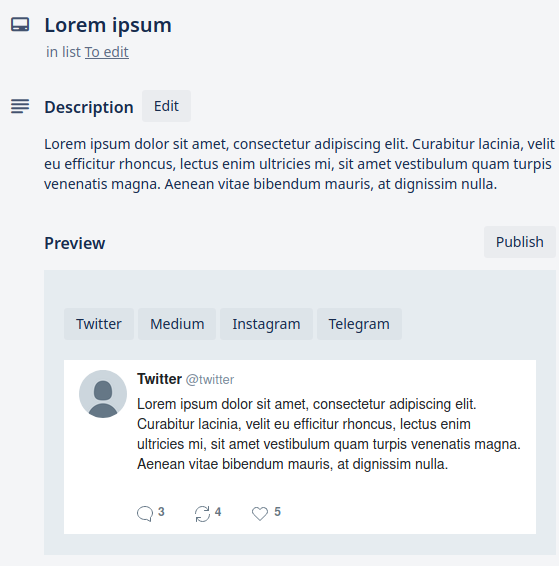
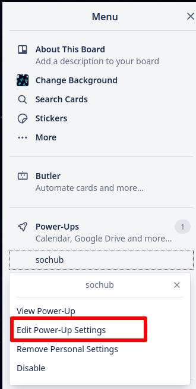
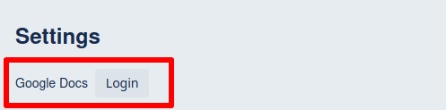
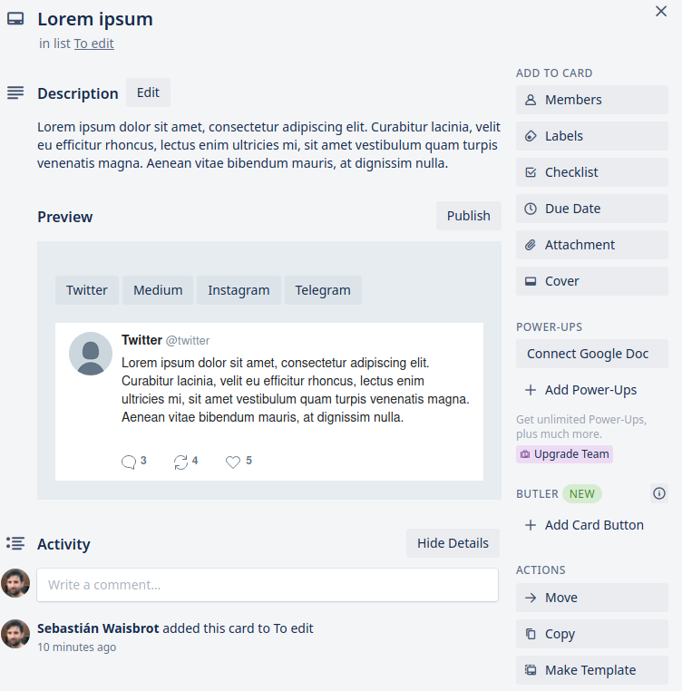
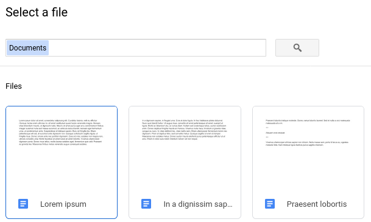
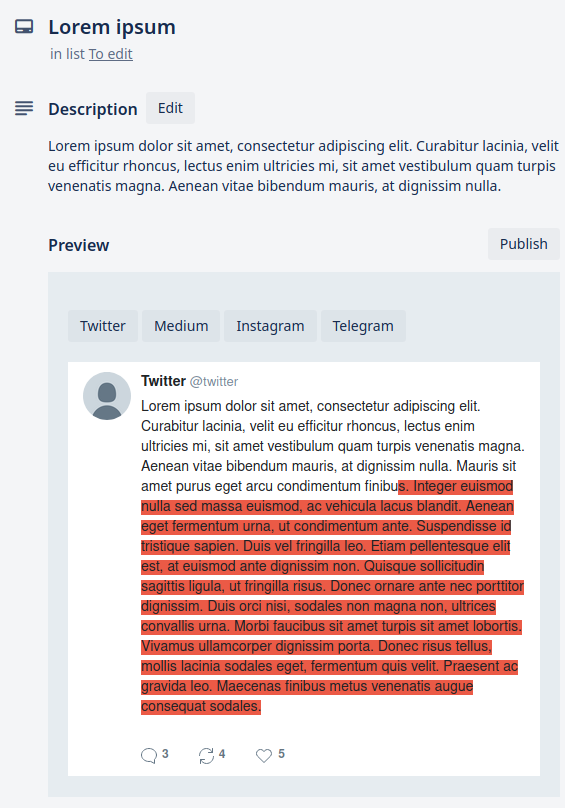
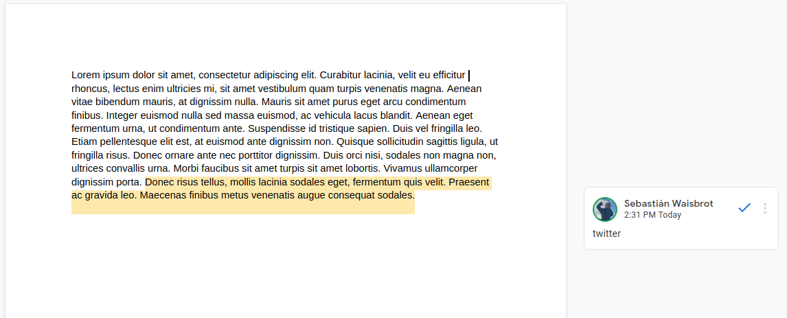
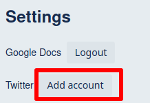
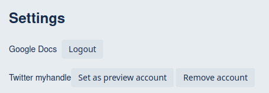

# Sochub

Sochub is a hub for social network. It simplifies the managing of media
accounts.

## Getting started

If you manage social media accounts for organizations, you probably use a tool
to organize when to publish, get content, share information. Trello does a lot
of that. But here's an extension that's specifically for that use case with some
improvements.

### Getting data

#### Trello Description

If you write a description in your Trello card, it will be used as content to
publish in all social networks.



#### Google Docs

If you want something more robust, you can actually write your post on Google
Docs and link it to your Trello card.

First log in to your Google account in the Power-Up Settings page.





Now you can go to your card and you will see a "Connect Google Doc" button and
pick your document.





Now the document will be an attachment, and the Preview will reflect its
content taking precedence over the description.



From Google Doc you can use comments to select portions of the text for
different social media outputs. If the comment is the name of a social network
(or more than one separated by commas) it will be displayed for it, and only
text with a comment selecting it will be included.



You can have more than one comment for each social network and they will all
be included.

If you want to replace a portion of the document for a social network, for
example if you are out of characters for twitter and you need to rephrase,
you can write the name of the social network, a colon, and then the output you
want for it. In that case it will _replace_ the selected content.

If you want to include an image, you can use markdown formatting:

```

```

Notice the URL can actually belong to a Trello attachment.

#### Canva

If you create content using Canva, it can be embeded in your card. Go to the
Publish options, use embed, copy its URL and paste it as an attachment in
Trello.


### Publishing

#### Twitter

You can set up Twitter accounts to publish directly from your card. Go to
settings, add account and authorize the application.






You can "Set as preview account" an account and everyone on your board will
see the preview of each card as if it was tweeted by that user.

Only people who had logged in to the Twitter account can actually publish. The
keys are not shared to other members of the board.

#### Medium

To set up a Medium account, you need to get an Integration token from
[here](https://medium.com/me/settings) and write it down to your settings page.

#### Telegram

For telegram you need to both create a bot and a channel.

First talk to [@BotFather](https://t.me/BotFather) to create a bot. It will
respond with a token.

Then create your public channel. In the settings page you will need to enter
both the bot token provided by BotFather, and the channel public id, for example
`@mychannel`.

#### Instagram

Instagram does not allow API posting. However if you attach a Canva embed (see
above) and name it "instagram" it will be seen as a preview of your post. You
can also set a display name for your organization in the preview.

## Deploy

Run pandoc-http.
Set up configuration in ./.env and ./trello/client.env following the examples,
build the trello client and run the web server:

```
$ docker run -d -p 3002:80 seppo0010/pandoc-http
$ cp .env{.example,}
$ cp trello/client/.env{.example,}
$ vi .env trello/client/.env
$ pushd trello/client && npm run build && popd
$ forever ./index.js
```
